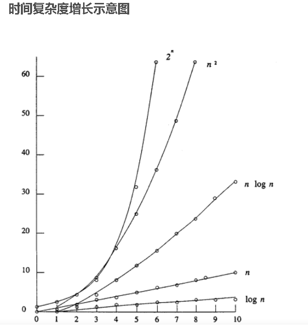
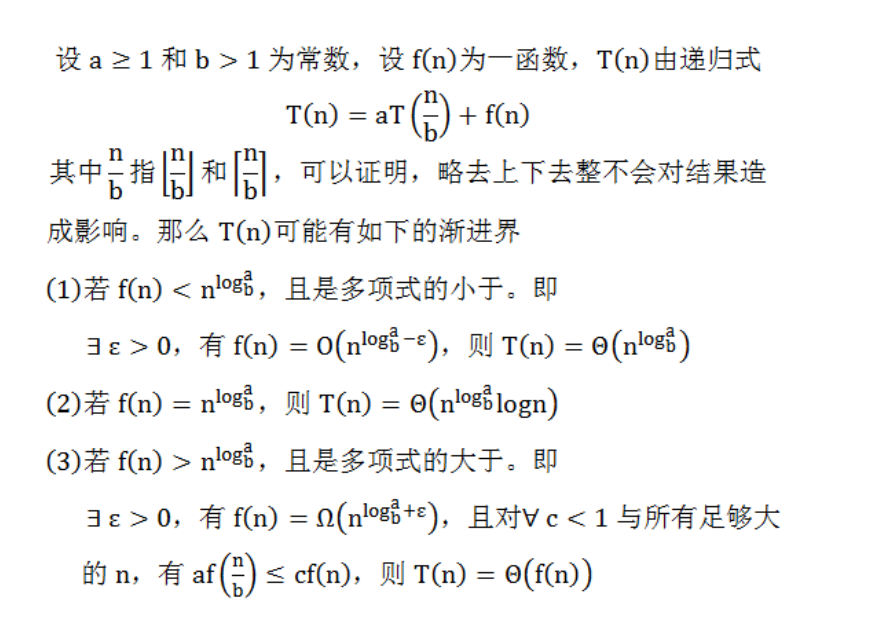
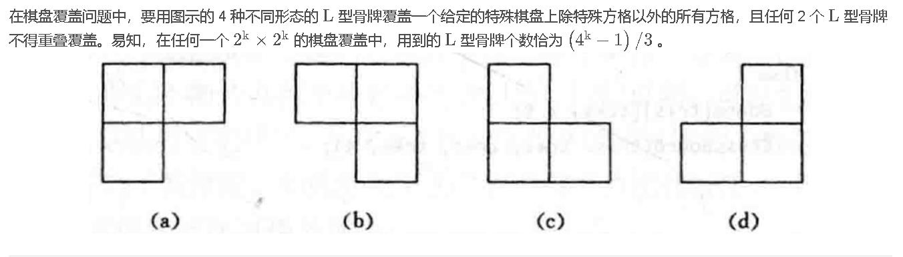

# 算法的概述

## 算法的四条性质

输入：有零个或者多个输入

输出：至少有一个输出

确定性：要没有歧义

有限性：执行次数是有限的不能是死循环

程序与算法不同。程序是算法用某种程序设计语言的具体实现。程序可以死循环

## 时间复杂性

时间复杂性的高低表现在运行该算法所需要的计算机资源，计算机资源要的越多时间复杂度越高，反之越低。计算机的资源主要体现在两个方面分别是空间上和时间上，因此算法可以在空间复杂度上分析也可在时间复杂度上分析

### 强调渐进复杂性的意义

1. 是算法效率的度量，是评价算法的重要依据
2. 复杂性高低主要看所需计算资源的多少 ，越多资源越低复杂性越高，越低复杂性越低
3. 简化复杂性分析步骤，只要看渐进意义下的阶，高效的算法随复杂性程度和规模增长大致成正比，低效的算法一般都是超线性的，绝非计算机运算速度所带来的性能提高能解决的

### 什么是算法复杂性，影响复杂性的因素有哪些

算法复杂性是指在执行过中所需要的资源度量 ，主要包括时间复杂性和空间复杂性


### 几种符号

O:渐进上线

Ω:渐进下线

θ:等价无穷小




### 主定理内容:



# 分治法

## 时间复杂度分析的技巧

T(n)=aT(n/b)+f(n);

1. f(n)=分合时间

   分合时间复杂度直接去掉递归的调用最后时间复杂度就是分合的时间复杂度f(n)

   最后根据递归树的高度乘以分合的时间复杂度f(n)就是最终问题的时间复杂度

2. 用主定理直接求时间复杂度

## 阶乘函数

$$
\left\{ 
\begin{array}{c}
	1\quad n=0  \\
    n(n-1)!\quad n>0
\end{array}
\right.
$$

```c++
int function(int n){
    if(n==0) return 1;
    else return function(n-1)*n;
}
```

## Fibonacci数列

$$
F(n)=
\begin{cases}
1\quad n=0\\
1\quad n=1\\
F(n-1)+F(n-2)\quad n>1

\end{cases}
$$

```c++
int f(int n){
    if(n<=1) return 1;
    else return F(n-1)+F(n-2)
}
```

## 排列问题(后续和回溯算法的解空间排列数有关系)

**问题描述:**全排列问题 把所有的情况输出出来

**原理:**Perm(R) 是由(ri)Perm(Ri)实现的Perm(Ri)又是由(ri-1)Perm(Ri-1)实现的（list中不止一个元素时候）

```c++
int Perm(int list[],int k,int m){//产生list[k:m]的所有排列组合
    if(k==m){//退出条件已经到了最后一个元素了
        for(int i=0;i<=m;i++){
            cout<<list[i]<<" ";
        }
        cout<<endl;
    }
    for(int i=k;i<=m;k++){
        swap(a[i],a[k]);
        Perm(list,k+1,m);
        swap(a[k],a[i]);//恢复环境
    }
}
```

## 整数划分问题

**问题描述：**n=n1+n2+n3+......+ni; 把符合条件的全部输出
$$
\left\{ 
\begin{array}{c}
	1\quad n=1,m=1  \\
    q(n,n)\quad n<m\\
    1+q(n,n-1)\quad n=m\\
    q(n,m-1)+q(n-m,m)\quad n>m>1\\
\end{array}
\right.
$$

## 汉诺塔问题

### 分析过程

#### 用分治策略分析 Hanoi 塔问题//TODO

#### 递归函数//TODO

#### 


```c++
void hanoi(int n,int a,int b,int c){//注意目标柱子为b
    hanoi(n-1,a,c,b);//a->c
    move(a,b);
    hanoi(n-1,c,b,a);//c->b
}
```

## 二分搜索技术

```c++
int a[1000];
int BinarySearch(int l,int r,int x){
    if(l>r) return -1;
    int mid;
    while(l<=r){
        mid = (l+r)>>1;
        if(x>a[mid]) l=mid+1;
        else if(x<a[mid]) r=mid-1;
        else return mid;
    }
    return -1;//没有找到
    //注意此时的l,r在没有找到时候分别指向最左边和最右边的边界
}
```

## Strassen算法

假设此时n=2
$$
\begin{bmatrix}
C_{11}&C_{12}\\
C_{21}&C_{22}
\end{bmatrix}
=
\begin{bmatrix}
A_{11}&A_{12}\\
A_{21}&A_{22}
\end{bmatrix}
\begin{bmatrix}
B_{11}&B_{12}\\
B_{21}&B_{22}
\end{bmatrix}
$$

$$
C_{ij}=A_{i_1i_2}B{j_1j_2}+A{i_3i_4}B{j_3j_4}
$$

一共需要8次乘法和4次加法，O(n^2)是子问题合并成大问题时候产生的时间（也可以认为是加法所消耗的时间）,上面的8是求4个Cij所需要的乘法计算

由此可得T(n)应该为
$$
T(n)=
\begin{cases}
O(a)\quad n=2\\
8T(n/2)+O(n^2)\quad n>2
\end{cases}
$$
运用主定理公式：
$$
n^{log_b^a}=n^{log_2^8}=n^3\\
f(n)=O(n^2)>O(n^3-e)\quad (e为任意常数)
$$
则该问题的时间复杂度为O(n^3)

**优化部分去看书我赌考试不会考**

## 归并排序

```c++
void MergeSort(int a[],int l,int r){
	if(l>r) return;
    int mid=(l+r)/2;
    MergeSort(a,l,mid);
    MergeSort(a,mid+1,r);
    //合并
    int temp[1000];
    int i=l,j=mid+1,k=0;//从目前数组的中间分割出两个有序的数组
    while(i<=mid&&j<=r){
        if(a[i]<=b[j]) temp[k++]=a[i++];
        else temp[k++]=a[j++];
    }
    while(i<=mid)temp[k++]=a[i++];
    while(j<=r) temp[k++]=a[j++];
    k=0; 
    for(int i=l;i<=r;i++){
        a[i]=temp[k++];
    }
}
```

### 举例说明过程

| 1    | 2    | 3    | 4    | 5    | 6    | 7    | 8    | 9    | 10   |
| ---- | ---- | ---- | ---- | ---- | ---- | ---- | ---- | ---- | ---- |
| 2    | 5    | 1    | 7    | 10   | 6    | 9    | 4    | 3    | 8    |

先递归分解

​											   <u>2 5 1 7 10 6 9 4 3 8</u>

​											<u>2 5 1 7 10</u>	<u>6 9 4 3 8</u>

​										<u>2 5 1</u>	<u>7 10</u>		<u>6 9 4</u>	<u>38</u>

​									<u>2 5</u>	<u>1</u>	<u>7</u>	<u>10</u>	<u>6 9 4</u>	<u>3</u>	<u>8</u>

合并

​									<u>2 5</u>	<u>1</u>	<u>7</u>	<u>10</u>	<u>6 9 4</u>	<u>3</u>	<u>8</u>

​										<u>1 2 5</u>	<u>7 10</u>		<u>4 6 9</u>	<u>38</u>	

​										  <u>1 2 5 7 10</u>			<u>3 4 6 8 10</u>						

​											   <u>1 2 3 4 5 6 7 8 9 10</u>		

从过程中可以发现在任何状态下都要经历这样的分治合过程。

分治的时间复杂度为O(n)递归树类似完全二叉树，树高为nlogn最终可以得到时间复杂的为O(nlogn) 

## 快速排序

```c++
int a[1000];
void QuickSort(int l,int r){
    if(l>r) return -1;
    x=a[(l+r)>>1];
    int i=l-1,j=r+1;
    while(l<r){
	    do i++; while(a[i]<=x);        
        do j--; while(a[j]>=x);
        if(l<r) swap(a[i],a[j]);
    }
    //最终状态是j在mid左边 l在mid的右边
    //分割
    QuickSort(l,j);
    QuickSort(j+1,r);
}
```

### 快排时间复杂度的分析

#### 最坏情况

**最坏情况：**不均匀的划分，例如左边一直是1一个元素，右边一直是n-1个元素。这样会导致我们的递归树的右子树的高度很长很长而我们的左子树一直保持一个较短的状态。

从时间复杂性T(n)上来分析

**分治的时间复杂度**由分解的问题的时间复杂度决定，

原T(n)=T(n-1)+T(n)。

**合的时间复杂度**由我们的问题规模n决定 ，因此时间复杂度为f(n)=O(n)
$$
T(n)=
\begin{cases}
O(1)\quad n<=1\\
T(n-1)+O(n)\quad n>1
\end{cases}
$$
这个要通过画解空间树来解决，最终树的高度为n,每一层治理的时间复杂度为O(n) 最终时间复杂度为O(n*n)

#### 最好情况

**最好情况：**均匀的划分，最好是像完全二叉树一样，这样我们的高度才是最小的。要完成这样的解空间构造，左右子树的问题规模分割要尽量保持一致。

从时间复杂度T(n)上来分析

**分治的时间复杂度**：T(n)=T(n/2)+T(n/2) 左右子树问题规模始终保持一致

**合的时间复杂度**由我们的问题规模n决定 ，因此时间复杂度为f(n)=O(n)
$$
T(n)=
\begin{cases}
O(1)\quad n<=1\\
2T(\frac{n}{2})+O(n)\quad n>1
\end{cases}
$$


通过主定理公式(符合主定理基本公式)
$$
n^{log_b^a}与f(n)的大小关系来决定时间复杂度 
$$

$$
n^{log_2^2}=n\quad易得时间复杂度为O(n)=O(n)最终时间复杂度为O(nlogn)
$$

通过递归树来求解:

如果使用递归树来求解则树高度为logn级别(完全二叉树的性质) 每一层的分治为O(n)则最终时间复杂度也为O(nlogn)级别

## 棋盘覆盖问题

 

**注意不是直接压上面的四个模块，而是如果目前的棋盘在四个方向上的某一块子棋盘没有特殊方块的情况下分别在靠近中心点的地方一次压入一个特色方块，这样压的3块特色方块合在一起就是上面的四个L形模块中的其中一个**

```c++
//tr tc表示棋盘左上角的行号列号
//dr dc特殊方格所在的行号列号
void chessBoard(int tr,int tc,int dr,int dc,int size){
    if(size==1) return;	//退出条件
    int t=tile++;	//L形骨牌号直接当记录递归次数就行了
    s=size/2;	//分割棋盘 size为宽度变原来一半
    //覆盖左上角的子棋盘
    if(dr<tr+s&&dc<tc+s){
        ChessBoard(tr,tc,dr,dc,s);
    }else{
        //用t号方块覆盖左上子棋牌的右下角(也就是当前棋盘靠中心点的左上方块)
        board[tr+s-1][tc+s-1]=t;
        //覆盖其余的方格
        ChessBoard(tr,tc,tr+s-1,tc+s-1,s);
    }
    //其他代码类似这里省略不写了
}
```

时间复杂度分析：
$$
T(k)算法是算法ChessBoard覆盖一个2^k*2^k所需要的时间，从算法分治策略可知T(k)满足以下的递归方程
\\T(n)=
\begin{cases}
O(1)\quad k=0\\
4T(k-1)+O(1)\quad k>0
\end{cases}
$$


每次分治的时间复杂度为O(1)合的时间复杂度，通过画递归树可知：第一层有四个子节点，第二层有十六个子节点........（除了叶子结点外每个结点都可以形成四个孩子结点）一共有k层则会产生4^k个问题结点每个层的问题规模都为k*O(1)

由此可得该问题的时间复杂度为
$$
T(K)=O(4^k)
$$
或

这里n的定义为边长大小为n的棋盘的用主定理可以求得：
$$
T(n)=
\begin{cases}
O(1)\quad n=1\\
4T(\frac{n}{2})+O(1)\quad n>1
\end{cases}
$$


$$
n^{log_b^a}=n^{log_2^4}=n^2\\
f(n)=O(1)<O(n^2)\\
$$
则时间复杂度为O(n^2)

由此可见定义不同的变量时间复杂度的表示也不同但是推荐用解法1

## 循环赛程问题

```c++
void fillTable(int x,int y,int step){
    if(step==1) return;
    step/=2;	//分解，把原问题分为四个表格的填写
    fillTable(x,y,step);	//治理填写左上子表格
    fillTable(x+step,y,step);	//治理填写左下的子表格
    //注意坐标要使用相对坐标
    for(int i=0;i<step;i++){
        for(int j=0;j<step;j++){
            table[x+step+i][y+step+j]=table[x+i][y+j];//将左上角的表格直接复制到右下角
            table[x+i][y+step+j]=table[x+step+i][y+j];//将左下角的子表格直接复制到右上角
        }
    }
}
```

## 集合划分问题

### 递归方程式

$$
f(n,m)=
\begin{cases}
1\quad n=0\&\&m=0\\
0\quad (n=0\&\&m!=0)||(m=0\&\&n!=0)\\
f(n-1,m-1)+m*f(n-1,m)
\end{cases}
$$

**f(n-1,m-1)+m*f(n-1,m)解析**

- 把前n-1个元素分为m-1个集合与最后一个元素组成m个集合划分
- 把前n-1个元素分为m个集合最后一个元素n随便插入到其他集合中共有m种情况

```c++
int SetSplit(int n,int m){
    if(n==0&&m==0) return 1;//0个元素划分成0个元素只有一种情况返回1
    if(n==0||m==0) return 0;//一个元素也没有要划分m个不成立，k个元素划分成0个不成立（最少也应该是1）
    return SetSplit(n-1,m-1)+m*SetSplit(n-1,m);
}
```

## 最大子段和的分治做法

```c++
int MaxSubSum(int *a,int left,int right){
	int sum=0;
    if(left==right)
        sum=a[left]>0?a[left]:0;
    else{
        int center=(left+right)/2;
        int leftsum=MaxSubSum(a,left,center);
        int rightsum=MaxSubSum(a,center+1,right);
        int s1=0;
        int lefts=0;
        for(int i=center;i>=left;i--){//以center结尾的左边求和
            if(lefts>s1)
                s1=lefts;
        }
        int s2=0;
        int rights=0;
        for(int i=center+1;i<=right;i++){//以center开头的右边求和
            right+=a[i];
            if(rights>s2)
                s2=rights;
        }
        sum=s1+s2;//看看最大sum是在分界处还是在两端
        if(sum<leftsum)
            sum=leftsum;
        if(sum<rightsum)
            sum=rightsum;
    }
    return sum;
}
```


# 动态规划问题

## 动态规划的性质

1. 最优子结构：当前问题的最优解包含着子问题的最优解

1. 重叠子问题：求解可行解时候有些子问题重复被计算过，而动态规划的数组就是把子问题最优解存储起来

## 动态规划四个步骤

1. 找出最优解，分析其结构特征(分析问题)
2. 递归的找出最优值(递归方程)
3. 自底向上的方式计算最优值(写代码)
4. 构造最优解（输出结果）

## 备忘录方法和动态规划法的异同

共同点：都有两个基本要素：最优子结构和重叠子问题

不同点：

1. DP自底向上

2. DPfor循环实现，备忘录递归实现

3. DP最小问题->大问题

   备忘录大问题->小问题

## 矩阵连乘问题(使得连乘的次数最少)

### 矩阵连乘的加括号方式

在计算有 \( n \) 个元素（如矩阵、数字等）的加括号方式时，可以使用卡塔兰数来解决这个问题。对于 \( n \) 个元素的加括号方式的数量 \( C(n-1) \) 可以通过以下公式计算：

$$
C(n) = \frac{1}{n+1} \binom{2n}{n}
$$


例如：

- 当 \( n = 2 \) 时，\( C(1) = 1 \) 
  $$
  即只有一种方式：(A_1 A_2)
  $$
  
- 当 \( n = 3 \) 时，\( C(2) = 2 \) 

$$
即两种方式：( (A_1 (A_2 A_3)) ) 和 ( ((A_1 A_2) A_3))
$$

- 当（n=k)时候,（C(k-1)=?)

### 分析过程

1. **找出最优解，分析其结构特征(分析问题)**

   - $$
     将矩阵连乘A_iA_{i+1}...A_j可以转换成A[i:j],考查A[1:n]的最优计算次序。\\
     这个问题的一个关键特征就是：计算A[1:n]的最优次序包含的计算矩阵的子链A[i:k]和A[k+1:n]的次序也应该是最优的。\\
     $$

2. **递归的找出最优值(递归方程)**

   递归式：
   $$
   P(n)=\begin{cases}
   1\quad n=1\\
   \sum_{k=1}^n-1 P(k)P(n-k)\quad n>1
   \end{cases}
   $$
   m\[i][j]的递归定义:
   $$
   m[i][j]=
   \begin{cases}
   0\quad i=j\\
   m[i-1][k]+m[k+1][j]+p[i-1]*p[k]*p[j]\quad i<j
   \end{cases}
   $$
   
3. **自底向上的方式计算最优值(写代码)**

```c++
void MatrixChain(int *p,int n,int **m,int **s){
    for(int i=1;i<=n;i++){//初始化m
        m[i][i]=0;
	}
    for(int r=2;r<=n;r++){
        for(int i=1;i<=n-r+1;i++){ //n-r+1是指还能获得多少组规模为r的子规模数量
            int j=i+r-1;//子规模问题最后一个矩阵是哪一个
            m[i][j]=m[i][i]+m[i+1][j]+p[i-1]*p[i]*p[j];//初始化
            s[i][j]=i;
            for(int k=i+1;k<j;k++){
                int t=m[i][k]+m[k+1][j]+p[i-1]*p[k]*p[j];
                if(t<m[i][j]){//寻找最优解
                    s[i]=k;
                    m[i][j]=t;
                }
            }
        }
    }
}
```

设我们的p数组的参数为

| 0    | 1    | 2    | 3    | 4    | 5    | 6    |
| ---- | ---- | ---- | ---- | ---- | ---- | ---- |
| 30   | 35   | 15   | 5    | 10   | 20   | 25   |

m数组

|  -   |  1   |   2   |  3   |  4   |   5   |     6     |
| :--: | :--: | :---: | :--: | :--: | :---: | :-------: |
|  1   |  0   | 15750 | 7875 | 9375 | 11875 | **15125** |
|  2   |      |   0   | 2625 | 4375 | 7125  |   10500   |
|  3   |      |       |  0   | 750  | 2500  |   5375    |
|  4   |      |       |      |  0   | 1000  |   3500    |
|  5   |      |       |      |      |   0   |   5000    |
|  6   |      |       |      |      |       |     0     |

**关于m数组的求解举例**
$$
t=m[i][k]+m[k+1][j]+p[i-1]*p[k]*p[j];
$$


对m\[1][6]的求解
$$
m[1][6]=min
\begin{cases}
m[1][1]+m[2][6]+p[0][1][6]=0+10500+30*35*25=36750\\
m[1][2]+m[3][6]+p[0][2][6]=15750+5375+30*15*25=34250\\
m[1][3]+m[4][6]+p[0][3][6]=7875+3500+30*5*25=15125\\
m[1][4]+m[5][6]+p[0][4][6]=9375+5000+30*10*25=21875\\
m[1][5]+m[6][6]+p[0][5][6]=11875+0+30*20*25=26875\\
\end{cases}
$$
可以得到最小值为15125则最优值为15125

4. 构造最优解（输出结果）

```c++
void Traceback(int i,int j,int **s){
	if(i==j){
        cout<<"A"<<i;
        return;//此时刚好只有一个数字没有什么好分割的
    } 
    //s[i][j]数组里面记录的是分割点位置一般都是k的位置
 	cout<<"(";
    Traceback(i,s[i][j],s);//i:k
	Traceback(s[i][j]+1,j,s);//下一层的k+1:j
    cout<<")";
}
```


## 最长公共子序列

```c++
void LCSLength(int m,int n,char *x,char *y,int **c,int **b){
    for(int i=1;i<=m;i++){//初始
        c[i][0]=0;
    }
    for(int i=1;i<=n;i++){
        c[0][i]=0;
    }
    for(int i=1;i<=m;i++){
        for(int j=1;j<=n;j++){
            if(x[i]==y[i]){
                c[i][j]=c[i-1][j-1]+1;
                b[i][j]=1;
            }
            else if (c[i-1][j]>c[i][j-1]){
                c[i][j]=c[i-1][j];
                b[i][j]=2;
            }
            else{
                c[i][j]=c[i][j-1];
                b[i][j]=3;
            }
        }
    }
}
```

## 0-1背包问题

### 分析过程

#### 递归的找出最优值

$$
f(i,j)=
\begin{cases}
f(i-1,j)\quad j<w[i]\\
max(f(i-1,j),f(i-1,j-w[i])+v[i])
\end{cases}
$$

#### 自底向上的求出最优值

| 物品 | 重量 | 价值 |
| ---- | ---- | ---- |
| 1    | 4    | 5    |
| 2    | 3    | 2    |
| 3    | 2    | 1    |

|      | 0    | 1    | 2    | 3    | 4    | 5    | 6    |
| ---- | ---- | ---- | ---- | ---- | ---- | ---- | ---- |
| 1    | 0    | 0    | 0    | 0    | 5    | 5    | 5    |
| 2    | 0    | 0    | 0    | 2    | 5    | 5    | 5    |
| 3    | 0    | 0    | 1    | 2    | 5    | 5    | 6    |

```c++
void Knapsack(int *v,int *w,int c,int n,int **m){
    for(int i=1;i<=n;i++){
        for(int j=0;j<=c;j++){
            dp[i][j]=dp[i-1][j];
            if(j>=w[i]){
                dp[i][j]=max(dp[i][j],dp[i-1][j-w[i]]+v[i]);//曲线救国 先求出在背包最大为j-w[i]且没有v[i]的情况
            }
        }
    }
    cout<<dp[n][c]<<endl;
    return;
}
```

## 完全背包问题

$$
max\sum_{i=1}^nc_ix_i=
\begin{cases}
\sum_{i=1}^n\quad a_ix_i<=b\\
x_i非负整数,\quad 1<=i<=n
\end{cases}
$$

### 递归方程的由来

在能装入的情况下
$$
m(i,j)=max(m(i-1,j-k*w[i])+k*v[i],m(i-1,j));
$$
优化一下
$$
f[i][j]=max(f[i-1][j],f[i-1][j-v[i]+w[i]],...,,f[i-1][j-k*v[i]+k*w[i]])\\
f[i][j-v[i]]=max(f[i-1][j-v[i]+w[i]],...,,f[i-1][j-k*v[i]+k*w[i]]))
$$
刚好相差w[i]则最终的状态转移方程为
$$
m[i][j]=
\begin{cases}
-=max(f[i-1][j],f[i][j-w[i]]+v[i])
\end{cases}
$$


```c++
void Knapsack(int *v,int *w,int c,int n,int **m){
    for(int i=1;i<=n;i++){
        for(int j=0;j<=c;j++){
            dp[i][j]=dp[i][j-1];
            if(j>=w[i]){
                dp[i][j]=max(dp[i][j],dp[i][j-w[i]]+v[i]);
            }
        }
    }
    cout<<dp[n][c]<<endl;
    return;
}
```

## 最大子段和

### 算法分析：

闫式dp法分析例子：

**状态表示**

- 条件：以第i个元素结尾的所有子段和
- 属性：Max

**状态计算（集合划分）：**

1. 第i个元素与前面的子段结合成新的子段
2. 第i个元素不结合新的子段 重新一段新的子段

**状态转移方程：**
$$
dp[i]=max(dp[i],dp[i-1]+a[i]);
$$

```c++
#include "iostream"
using namespace std;
typedef long long ll;

const int maxn = 5000;
ll dp[maxn], a[maxn];
int main()
{
    int n;
    cin >> n;
    for(int i = 1; i <= n; i++)
    {
        cin >> a[i];
        dp[i] = a[i];
    }
    for(int i = 1; i <= n; i++)
    {
        dp[i] = max(dp[i], dp[i - 1] + a[i]);
    }
    ll ans = 0;
    for(int i = 1; i <= n; i++)ans = max(ans, dp[i]);//找这些以i结尾的子段和之中最大的子段和
    cout<<ans<<endl;
    return 0;
}
```

# 贪心问题

## 贪心算法的基本要素

1. 贪心选择性质：局部最优可以推出整体最优
2. 最优子结构性质：一个问题的最优解包含着其子问题的最优解

### 贪心算法与动态规划算法的差异

//TODO

## 活动安排问题

```c++
//先将活动进行排序 按照完成时间进行排序 s f 分别存储第i个事件的其实时间和完成时间
void GreedySelector(int n,int s[],int f[],bool a[]){
    A[1]=true; //第一个能选
    int j=1;//上一个被选的完成时间
    for(int i=2;j<=n;j++){
        if(s[i]>=f[j]){
            A[i]=true;//选
            j=i;
        }else{
            A[i]=false;//不选
        }
    }
}
```

## 最优装载问题

```c++
#include "iostream"
#include "bits/stdc++.h"
#include "vector"
using namespace std;
struct node{
    int w;
    int v;
};
bool cmp(node a,node b){
    return a.v<b.v;
}
int main(){
    int n,t;
    cin>>n>>t;
    vector<node> a(n+1);
    for(int i=1;i<=n;i++){
        int v;
        int tt;
        cin>>tt>>v;
        a[i].w=tt;
        a[i].v=v;
    }
    sort(a.begin()+1,a.end()+1,cmp);
    double retv=0;
    int i;
    for(i=1;i<=n;i++){
        if(t>=a[i].w){
            t-=a[i].w;
            retv+=a[i].v;
        }else{
            break;
        }
    }
    cout<<retv<<endl;
    return 0;
}

```


## 背包问题

```c++
#include "iostream"
#include "bits/stdc++.h"
#include "vector"
using namespace std;
struct node{
    int w;
    double v;
    double p;
};
bool cmp(node a,node b){
    return a.p>=b.p;
}
int main(){
    int n,t;
    cin>>n>>t;
    vector<node> a(n+1);
    for(int i=1;i<=n;i++){
        double v;
        int tt;
        cin>>tt>>v;
        a[i].w=tt;
        a[i].v=v;
        a[i].p=v/tt;//记录
    }
    sort(a.begin()+1,a.end()+1,cmp);
    double retv=0;
    int i;
    for(i=1;i<=n;i++){
        if(t>=a[i].w){
            t-=a[i].w;
            retv+=a[i].v;
        }else{
            break;
        }
    }
    if(t>0&&i<=n){
        retv+=a[i].v*(double(t)/double(a[i].w));
    }
    cout<<fixed<<setprecision(2)<<retv<<endl;
    return 0;
}

```

## 哈夫曼编码

```c++
#include "iostream"
#include "unordered_map"
#include "bits/stdc++.h"
using namespace std;

//哈夫曼结点
struct Node{
    char data;
    int freq;
    Node* left;
    Node* right;
    Node(char d,int f):data(d),freq(f),left(nullptr),right(nullptr){}
};
struct Compare{
    bool operator()(Node *left,Node *right){
        return left->freq > right->freq;//要小根堆
    }
};


//构造数的函数
Node* buildHuffmanTree(const unordered_map<char,int>& freqMap) {
    priority_queue<Node *, vector<Node *>, Compare> minHeap;
    // 将每个字符及其频率创建成一个节点，并加入到小根堆中
    for (const auto &pair: freqMap) {
        minHeap.push( new Node(pair.first, pair.second));
    }
    //构造哈夫曼树
    while(minHeap.size()>1){
        Node* left=minHeap.top();//最小
        minHeap.pop();
        Node* right=minHeap.top();//次小
        minHeap.pop();

        //合并结点创建父结点
        Node* parent=new Node('\0',left->freq+right->freq);
        parent->left=left;
        parent->right=right;
        minHeap.push(parent);
    }
    return minHeap.top();
}

//前序遍历
void generateHuffmanCodes(Node* root,const string& str,unordered_map<char,string>& huffmanCodes){
    if(!root) return;
    if(!root->left&&!root->right){//叶子结点就是找到了
        huffmanCodes[root->data]=str;
    }
    generateHuffmanCodes(root->left,str+'0',huffmanCodes);
    generateHuffmanCodes(root->right,str+'1',huffmanCodes);
}

int main1() {
    int freq[]={1,2,3,5,8,13,21,62};
    // 统计字符的频率
    unordered_map<char, int> freqMap;
    int n=sizeof(freq)/sizeof(freq[0]);
    for(int i=0;i<n;i++){
        cout<<char('a'+i)<<"\t";
        freqMap[char('a'+i)]=freq[i];
    }
    cout<<endl;
    for(int i : freq){
        cout<<i<<"\t";
    }
    cout<<endl;
    // 构建哈夫曼树
    Node* root = buildHuffmanTree(freqMap);
    // 生成哈夫曼编码
    unordered_map<char, string> huffmanCodes;
    generateHuffmanCodes(root, "", huffmanCodes);
    // 输出哈夫曼编码
    cout << "Huffman Codes: \n";
    for(int i=0;i<n;i++){
        cout<<char(i+'a')<<":\t"<<huffmanCodes[char(i+'a')]<<endl;
    }
    return 0;
}
```


# 回溯法

## 递归技术的优缺点

优点：

1. 问题分解
2. 代码清晰
3. 适用性
4. 逻辑一致性

缺点：

1. 性能开销大
2. 内存消耗大
3. 难以调试
4. 潜在死循环
5. 效率问题

## 两种解空间的模板

### 子集树模板

```c++
void Backtrack(int t){
	if(t>n){
        Output(x);
    }else{
        for(int i=0;i<=1;i++){//进入两次就生成两个枝 有点像完全二叉树
            x[t]=i;
            if(Constraint(t)&&Bound(t)){//约束条件和边界条件
                Backtrack(t+1);
            }
        }
    }
}
```

### 排列树模板

```c++
void Backtrack(int t){
		if(t>n){
        Output(x);
    }else{
        for(int i=t;i<=n;i++){
         	swap(x[t],x[i]);
            if(Constraint(t)&&Bound(t)){//约束条件和边界条件
                Backtrack(t+1);
            }
            swap(x[i],x[t]);
        }
    }
}
```

## n皇后问题

### 排列数做法

```c++
#include "iostream"
#include "algorithm"
using namespace std;

int x[1000];
int n;
int sum=0;
bool isok(int k){
    for(int j=1;j<k;j++){
        if(abs(k-j)==abs(x[j]-x[k])||x[k]==x[j]){
            return false;
        }
    }
    return true;
}
void dfs(int t){
    if(t>n){
        sum++;
        if(sum<=3){
            for(int i=1;i<=n;i++){
                cout<<x[i]<<" ";
            }
            cout<<endl;
        }
        return;
    }
    //用排列树
    for(int i=t;i<=n;i++){
        swap(x[t],x[i]);
        if(isok(t)) dfs(t+1);
        swap(x[i],x[t]);//恢复环境
    }
}
int main(){
    //要输出所有的结果
    //n皇后问题
    cin>>n;
    //初始化x
    for(int i=1;i<=n;i++){
        x[i]=i;
    }
    dfs(1);
    cout<<sum<<endl;
}
```

### 子集树做法

```c++
#include "iostream"
#include "algorithm"
using namespace std;

int x[1000];
int n;
int sum=0;
bool isok(int k){
    for(int j=1;j<k;j++){
        if(abs(k-j)==abs(x[j]-x[k])||x[k]==x[j]){//第一个条件是用斜率判断是否在正负对角线，第二个条件是判断是否在同一列
            return false;
        }
    }
    return true;
}
void dfs(int t){
    if(t>n){
        sum++;
        if(sum<=3){
            for(int i=1;i<=n;i++){
                cout<<x[i]<<" ";
            }
            cout<<endl;
        }
        return;
    }
    //用子集
    for(int i=t;i<=n;i++){
      	x[t]=i;
        if(isok(t)) dfs(t+1);
    }
}
int main(){
    //n皇后问题
    cin>>n;
    dfs(1);
    cout<<sum<<endl;
}
```

## 0-1背包问题

```c++
void Knap(int i){
    if(i>n){
        bestp=max(bestp,cp);
        return;
    }
    if(cw+w[i]<=c){
        cw+=w[i];
        cp+=p[i];
        Knap(i+1);
        cp-=p[i];
        cw-=p[i];
    }else if(Bound(i+1)>bestp){//还有机会拿到比bestp更大的可行解
        //Bound函数的实现具体就是部分背包问题的贪心解
        Knap(i+1);
    }
}
```

### 最大团问题

**解释：**其实就是最大完全子图问题。

```c
Backtrack(i){
    if(i>n){//如果到达叶子结点
        for(int j=1;j<=n;j++)
            bestx[j]=x[j];
        bestn=cn;
        return;
    }
    ok=1;
    for(j=1;j<i;j++){
        if(x[j]=1&&a[i][j]=0){//和前面已经被选的没有连接
            ok=0;
            break;
        }
    }
    if(ok){
        x[i]=1;
        cn++;
        Backtrack(i+1);
        cn--;
        x[i]=0;
    }
    if(cn+n-i>bestn){//进入右子树
        x[i]=0;
        Backtrack(i+1);
    }
}

```

### 旅行售货员问题

```c++
void Traveling::Backtrack(int i)
{
    if(i == n)
    {
        cout<<"当前第"<<i<<"层为最后一层"<<",选择"<<x[i]<<endl;
        if(a[x[n-1]][x[n]] != NoEdge && a[x[n]][1] != NoEdge && (cc+a[x[n-1]][x[n]]+a[x[n]][1] < bestc || bestc==NoEdge))
        {
            cout<<"得到一个更优解:";
            for(int j=1; j<=n; j++)
            {
                bestx[j] = x[j];
                cout<<x[j]<<" ";
            }
            bestc = cc+a[x[n-1]][x[n]]+a[x[n]][1];
            cout<<"最优解更新为:"<<bestc<<endl;
        }
        else 
        {
            for(int j=1; j<=n; j++)
                cout<<x[j]<<" ";
            cout<<"此路径得不到更优解,回溯到第"<<i-1<<"层"<<endl;
        }
    }
    else
    {
        for(int j=i; j<=n; j++)
        {
            //是否可以进入x[j]子树
            if(a[x[i-1]][x[j]] != NoEdge && (cc+a[x[i-1]][x[j]] < bestc || bestc==NoEdge))  //剪枝函数
            {
                //搜索子树
                swap(x[i], x[j]);  //必须交换,这样才可以做到使得x[2:i]的表示已经选过的,x[i+1:n]表示还未选过!!!
                cc += a[x[i-1]][x[i]];
                cout<<"当前第"<<i<<"层"<<",选择"<<x[i]<<",递归深入一层,将到达第"<<i+1<<"层"<<endl;
                Backtrack(i+1);
                cout<<"当前第"<<i+1<<"层,递归回退一层,将到达第"<<i<<"层"<<endl;
                cc -= a[x[i-1]][x[i]];
                swap(x[i], x[j]);
            }
            else cout<<"不满足剪枝函数,对应子树被剪枝"<<endl;
        }
    }
}
```


# 分支界限法

## 0-1背包问题(不是很理解到时候去听一听)

```c++
void MaxKnapsack(){
    H=new MaxHeap<HeapNode<Typep,Typew>(1000);
   	bestx=new int [n+1];
    //初始化
    int i=1;
    E=0;
    cw=cp=0;
    int bestp=0;//当前最优值
    int up=Bound(i);//价值上界
    while(i!=n+1){//不是叶子结点
        int wt=cw+w[i];
        if(wt<=c){//左子树有机会
            if(cp+p[i]>bestp)
                bestp=cp+p[i];
            AddLiveNode(up,cp+p[i],cw+w[i],true,i+1);//选
        }
        up=Bound(i+1);
        if(up>=bestp) AddLiveNode(up,cp,cw,false,i+1);//不选
        HeapNode<Typep,TypeW> N;
        H->DeleteMax(N);//提取出最大的结点
        E = N.ptr;
        cw=N.weight;
        cp=N.profit;
        up=N.uprofit;
        i=N.level;
    }
    //构造最优解
    for(int j=n;j>0;j--){
        bestx[j]=E->child;
        E==E->parent;
    }
    return cp;
}
```


